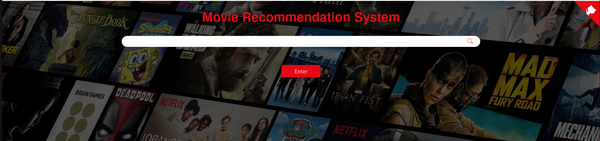
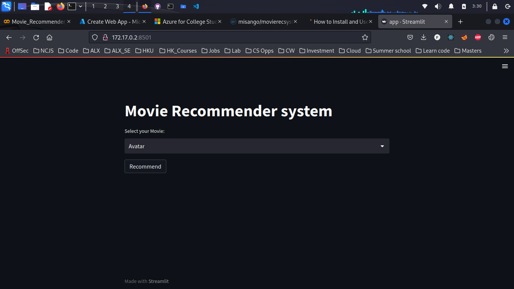

# Movie Recommendation System 

This Natural Language Processing Naives Bayes model curates movie recommendations for its users. Movie details are fetched usinf an API provided by TMDB. I then fetched the id of the movie in the API using webscraping to get user reviews given by the user in the IMDB site using 'beautiful soup' and chose to do a sentiment analysis on them. I am still learning on how I can apply Hugging Face BART Models to improve the analysis

## How to get the API key?qui

Create an account in https://www.themoviedb.org/, click on the `API` link from the left hand sidebar in your account settings and fill all the details to apply for API key. If you are asked for the website URL, just give "NA" if you don't have one. You will see the API key in your `API` sidebar once your request is approved.

## How to run the project?

* Clone or download this repository to your local machine.
* Install all the libraries mentioned in the `requirements.txt` file with the command `pip install -r requirements.txt`
* Get your API key from https://www.themoviedb.org/. (Refer the above section on how to get the API key)
* Replace YOUR_API_KEY in **both** the places (line no. 15 and 29) of `static/recommend.js` file and hit save
* Open your terminal/command prompt from your project directory and run the file `main.py` by executing the command `python main.py`.
* Go to your browser and type `http://127.0.0.1:5000/` in the address bar.
* The project should run
* To learn the ML code deeper, investigate the `sentiment.ipynb` closer and do some tuning 

## Architecture

## Similarity Score : 

   How does it decide which item is most similar to the item user likes? Here come the similarity scores.
   
   It is a numerical value ranges between zero to one which helps to determine how much two items are similar to each other on a scale of zero to one. This similarity score is obtained measuring the similarity between the text details of both of the items. So, similarity score is the measure of similarity between given text details of two items. This can be done by cosine-similarity.
   
## How Cosine Similarity works?
  Cosine similarity is a metric used to measure how similar the documents are irrespective of their size. Mathematically, it measures the cosine of the angle between two vectors projected in a multi-dimensional space. The cosine similarity is advantageous because even if the two similar documents are far apart by the Euclidean distance (due to the size of the document), chances are they may still be oriented closer together. The smaller the angle, higher the cosine similarity.
  
  

  
More about Cosine Similarity : [Understanding the Math behind Cosine Similarity](https://www.machinelearningplus.com/nlp/cosine-similarity/)

### Sources of the datasets 

* Kaggle : https://www.kaggle.com/code/rounakbanik/movie-recommender-systems

1. To run this program, clone the repo and unzip the `similarity.pkl.zip` file. 
2. Run `pipenv shell`
3. Run `streamlit run app.py`
4. The Model's website should open in a new Browser window

